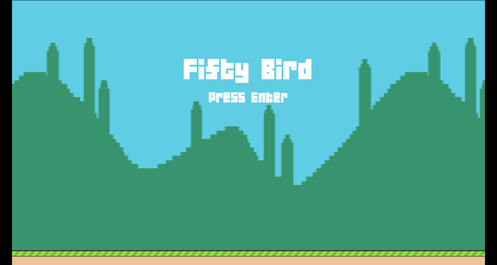
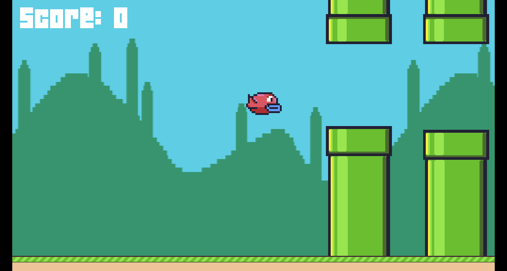
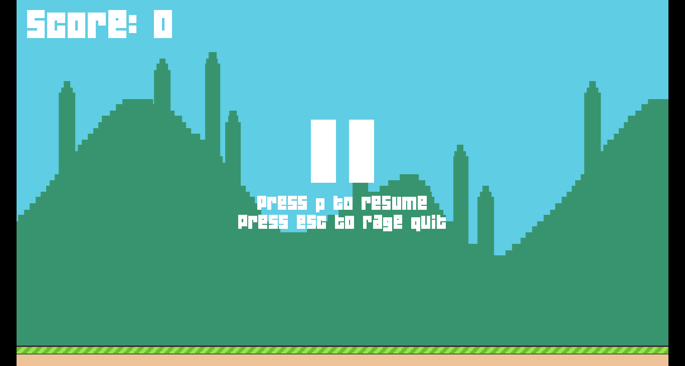
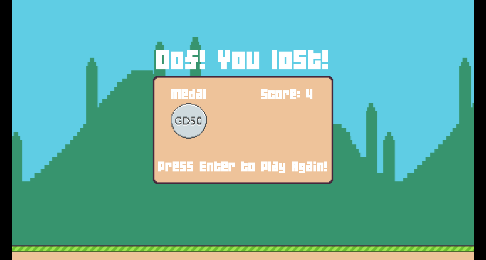

# Assignment 1: Fifty Bird
In this assigment we were told to add some extra features to the Fifty Bird (Flappy Bird copycat):
* Randomize vertical gap between pipes.
* Randomize horizontal spacing of pipes.
* Set medal awards based on score.
* Implement pause/resume feature.
As an extra, I also fixed it so the bird can't go above the visible screen, over the pipes, and cheat the game.

## Requirements
You need **Lua** and **Löve2D 0.10.2**.

## Usage
1. Download this folder from the repository.
2. On a terminal, access ``` /assigment1 ``` directory.
3. Run ``` love . ```

## Screenshots



