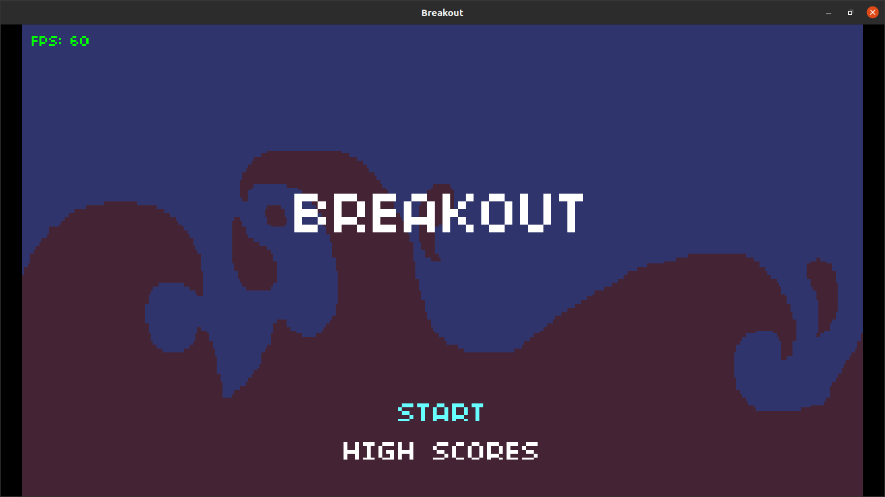
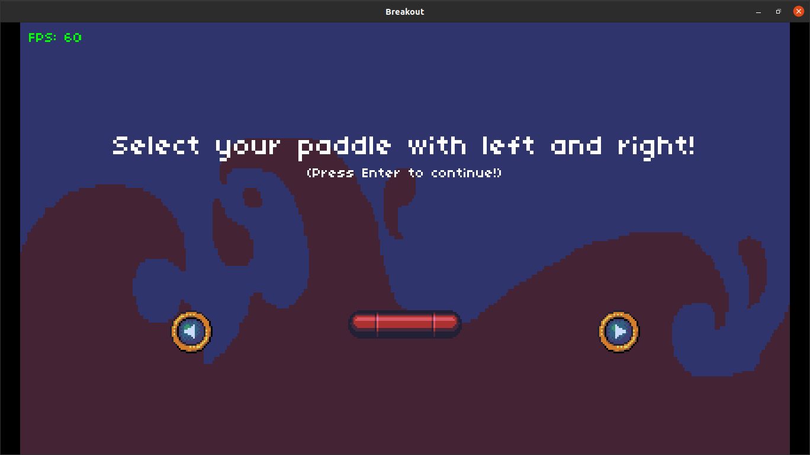
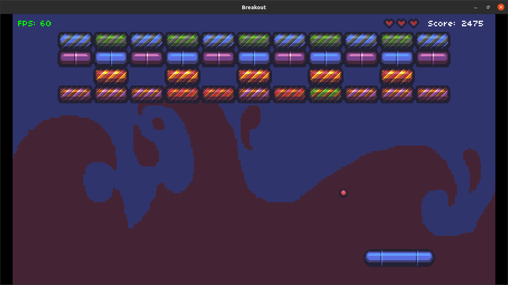
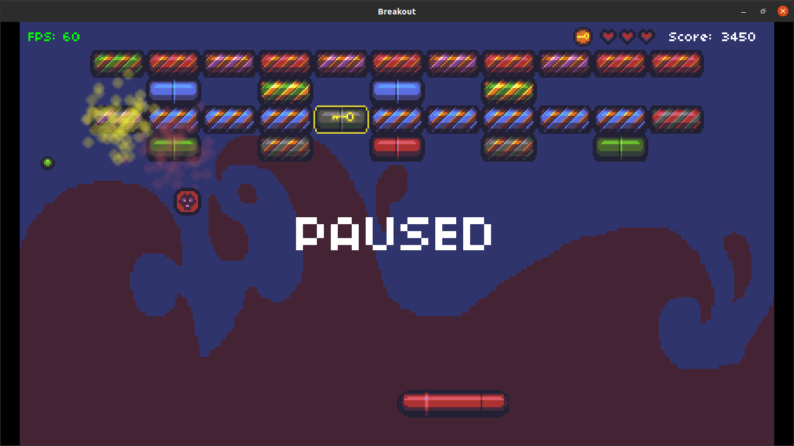

# Assignment 2: Breakout
In this assigment we were told to add some extra features to a copy of an old classic game: Breakout. Here is a list of the features I implemented:
* Add powerups:
  * Growth -> makes the paddle longer.
  * Double ball -> adds an extra ball.
  * Heart -> to recover lifes.
  * Key -> if there are locked bricks on the level, this powerup allows you to open them, getting extra points. You will only get one chance to get this powerup per level with a locked brick, so don't lose it!
* Add the spawn of random locked bricks, only possible to open having a Key powerup. 
  
## Requirements
You need **Lua** and **Löve2D 0.10.2**.

## Usage
1. Download this folder from the repository.
2. On a terminal, access ``` /assigment2 ``` directory.
3. Run ``` love . ```

## Screenshots



