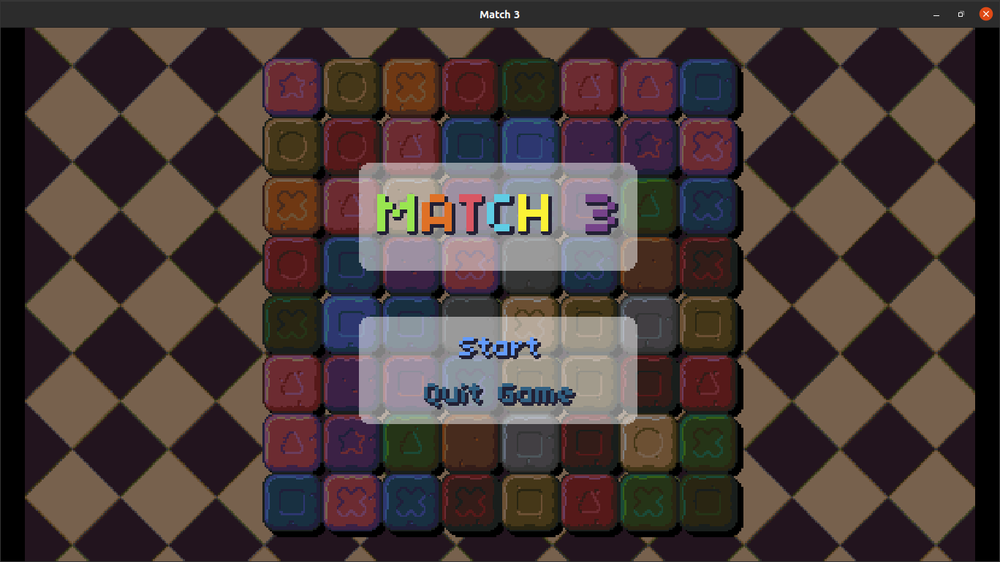
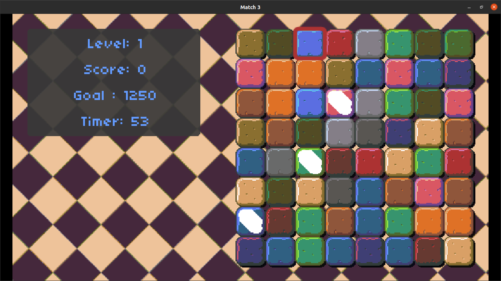
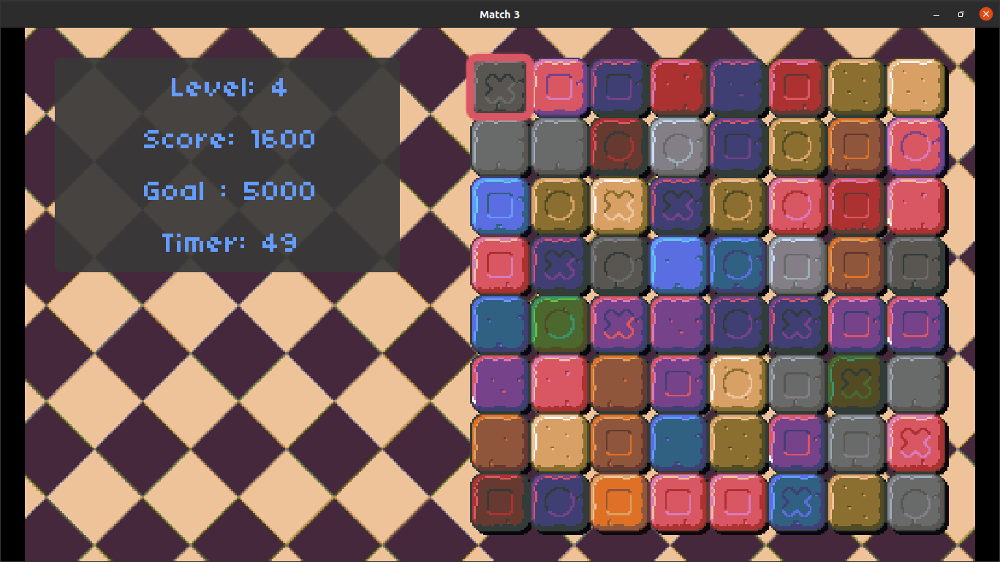

# Assignment 2: Breakout
In this assigment we were handed the task of implementing the following features for a Match 3 style game:
* Add 1 second extra to the timer per tile on a match.
* As levels progress, more variety of tiles spawn (with different shapes on them), each of them add different ammounts of points.
* Shiny tiles can spawn. If matched, if the match is in a row, it will destroy the whole row adding all the points for all those destroyed tiles. Equally for column matches.
* Only matches that result on match are allowed.
* Only tile configuration with matches available are offered to the player.

As an extra, I also implemented:
* The mouse can be used as well to swap tiles.
* Shiny tiles are visually identified with an animation.
* Extra sounds for when:
  * the board resets when there's no more matches available, 
  * a shiny tile is matched.
  
## Requirements
You need **Lua** and **Löve2D 0.10.2**.

## Usage
1. Download this folder from the repository.
2. On a terminal, access ``` /assigment3 ``` directory.
3. Run ``` love . ```

## Screenshots


