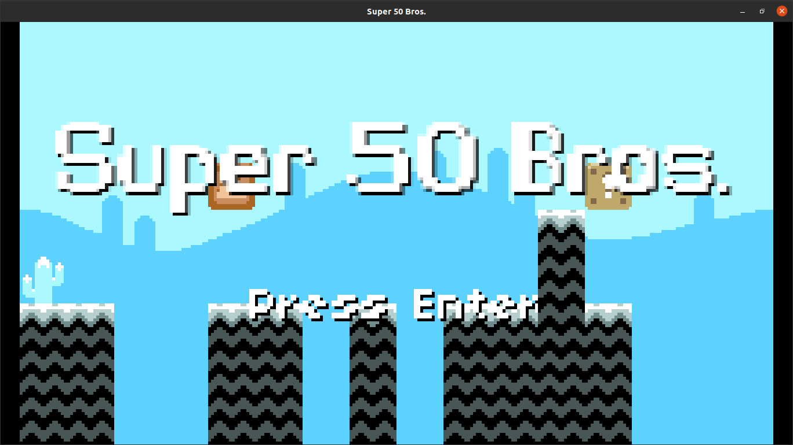
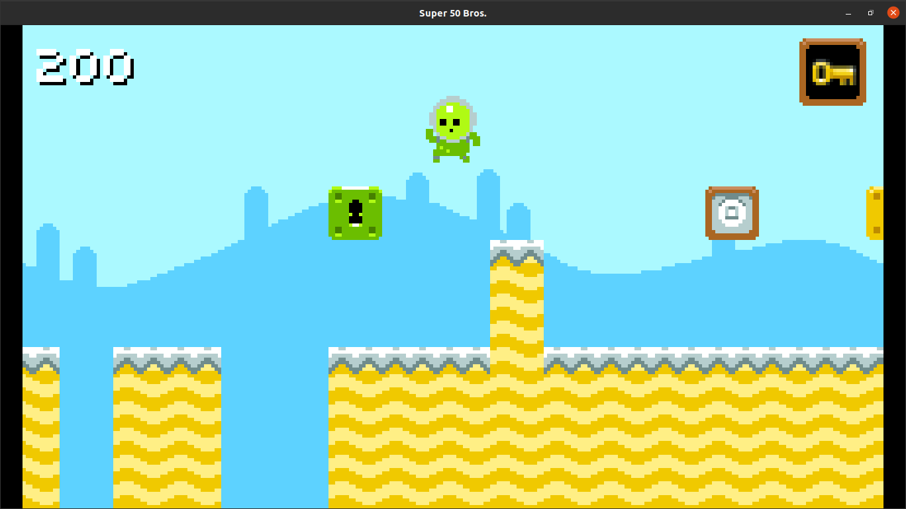
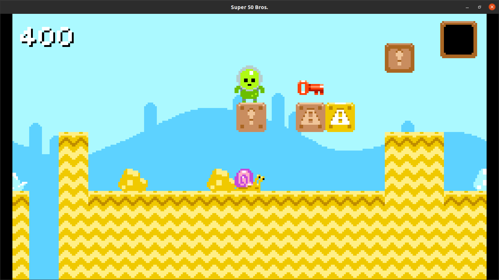
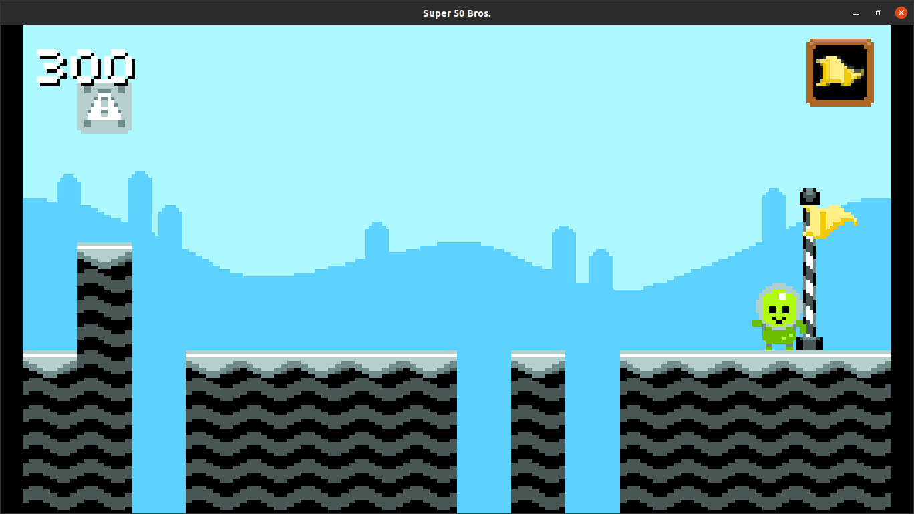

# Assignment 4: Super 50 Bros.
In this assigment we were handed the task of implementing the following features for a Super Mario Bros. style game:
* Make it so the the player is always spawned with ground beneath.
* Add a key item to grab.
* Add a locked block which could be opened with the key.
* Both, key and locked block, spawn on random positions every time.
* Spawn a pole at the end of the level.
* After opening the block, a flag is obtained and the possibility of going to the next level once the pole at the end of the level is reached.
* Implement transition to a new level, keeping the player's current score and making the level sligthly longer.

As an extra, I also implemented:
* Show an item holder on the top right corner of the screen to show the player feedback about the key or flag collected.
* No unaccessible blocks are spawn on the level. For instance, a block surrounded by two pillars should not spawn.
* Added animation to the flag, both rising animation and waving animation.
* Added celebretion animation to the player once the level is completed.
* Fixed the player being able to walk over one tile gaps.
* Added some extra sound effects.
  
## Requirements
You need **Lua** and **Löve2D 0.10.2**.

## Usage
1. Download this folder from the repository.
2. On a terminal, access ``` /assigment4 ``` directory.
3. Run ``` love . ```

## Screenshots





