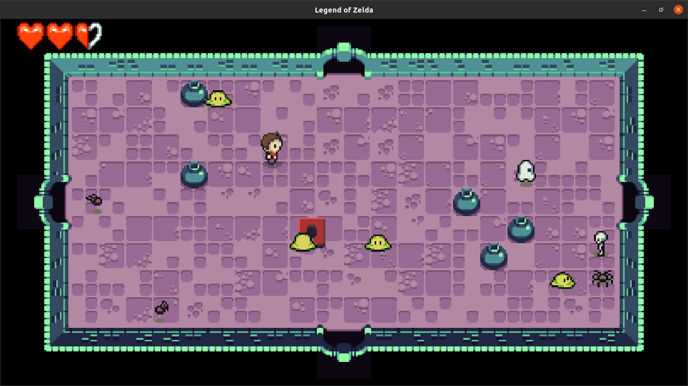

# Assignment 5: Legend of 50
In this assigment we were handed the task of implementing the following features for a Legend of Zelda (dungeon crawler) style game:
* Implement hearts that sometimes drop from vanquished enemies at random, which will heal the player for a full heart when picked up (consumed). 
* Add pots to the game world at random that the player can pick up, at which point their animation will change to reflect them carrying the pot.
* When carrying a pot, the player should be able to throw the pot. When thrown, the pot will travel in a straight line based on where the player is looking. When it collides with a wall, travels more than four tiles, or collides with an enemy, it should disappear. 

As an extra, I also implemented:
* Animation for when a pot breaks.
* Death animation for all the mobs.
* Collision with two pots result in the destruction of all the hit pots.
  
## Requirements
You need **Lua** and **Löve2D 0.10.2**.

## Usage
1. Download this folder from the repository.
2. On a terminal, access ``` /assigment5 ``` directory.
3. Run ``` love . ```

## Screenshots





