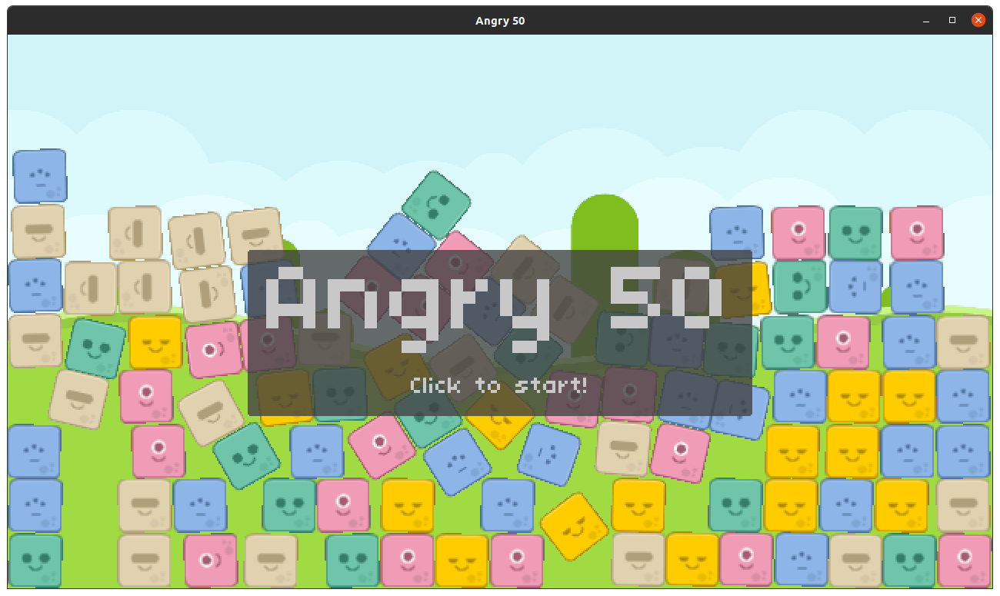
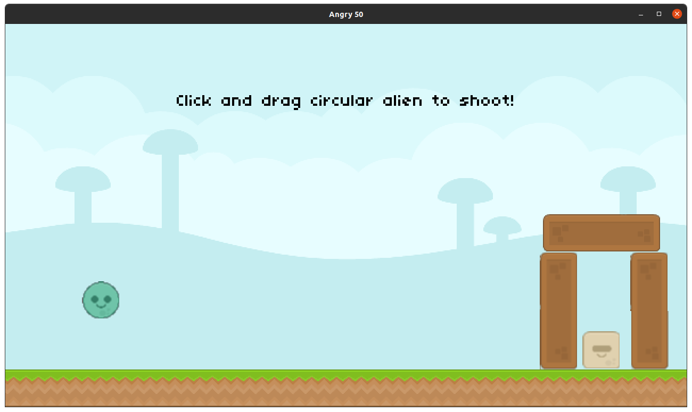
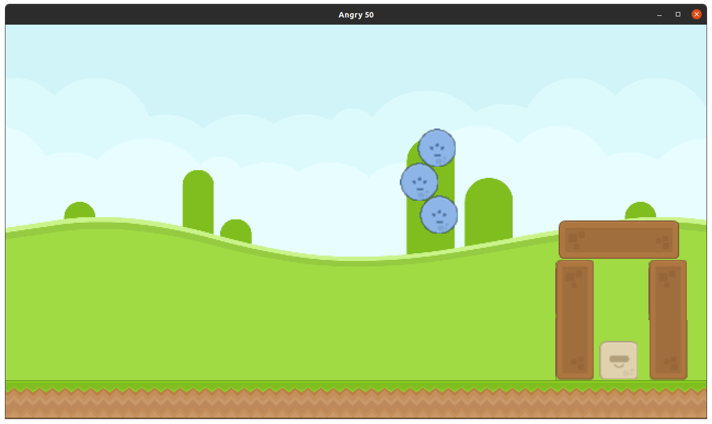
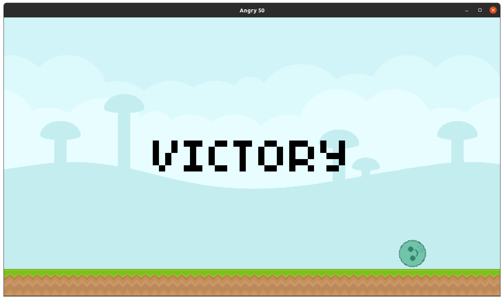

# Assignment 6: Angry 50
In this assigment we were handed the task of implementing the following features for a Angry Birds style game:
* Add an alien that will divide itself in three (as the blue bird from Angry Birds) when the spacebar is pressed and only if the alien hasn't collided with anything yet.

As an extra, I also implemented:
* Improved how the game restarted after throwing an alien.
* Added particle systems for alien's explosions, similar to Angry Birds.
  
## Requirements
You need **Lua** and **Löve2D 0.10.2**.

## Usage
1. Download this folder from the repository.
2. On a terminal, access ``` /assigment5 ``` directory.
3. Run ``` love . ```

## Screenshots






